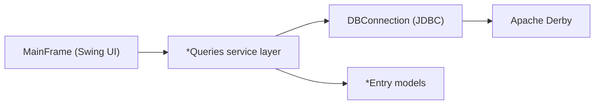

# Course Scheduler

A Java Swing desktop application for semester planning, enrollment, and waitlist management, backed by Apache Derby.

## At A Glance

| Area | What this project does |
| --- | --- |
| App type | Java Swing desktop course scheduling system |
| Users | Supports both administrator and student workflows |
| Core workflows | semester setup, class creation, enrollment, waitlisting, and roster management |
| Data layer | Apache Derby database with JDBC-backed query services |
| Logic | Enforces seat limits and promotes waitlisted students automatically |
| Architecture | UI -> query service layer -> JDBC connection -> Derby |
| Tooling | NetBeans/Ant structure plus local setup scripts |
| CI | GitHub Actions compile verification |

## Why this is portfolio-ready
- Clear separation of concerns between UI (`MainFrame`), query services (`*Queries`), and data models (`*Entry`).
- End-to-end workflows for both administrator and student operations.
- Real relational data modeling with class capacity and waitlist promotion logic.
- Configurable database connection for local or hosted Derby instances.

## Core features
- Add and switch semesters.
- Create courses and open class sections with seat limits.
- Register students and manage their schedules.
- Auto-waitlist students when a class is full.
- Promote waitlisted students when seats open.
- Display class rosters and student schedules.
- Includes a polished, modernized Swing visual theme.

## Tech stack
- Java 11
- Java Swing (desktop UI)
- Apache Derby (network server mode)
- NetBeans/Ant project structure
- GitHub Actions (compile verification CI)

## Architecture snapshot

## Repository structure
- `CourseSchedulerVayunandanreddyPannalaVFP5175/` — primary NetBeans Java project
- `CourseSchedulerDBVayunandanreddyPannalaVFP5175/` — existing Derby database snapshot
- `database/` — schema and sample seed scripts for fresh setup
- `scripts/` — local setup helpers
- `docs/` — architecture, setup, and roadmap docs

## Quick start
1. Install prerequisites listed in [`docs/SETUP.md`](docs/SETUP.md).
2. Start Derby network server:
   - `./scripts/start-derby-server.sh`
3. Initialize database (optional if using the existing snapshot):
   - `./scripts/create-schema.sh`
4. Seed demo data (optional):
   - `./scripts/load-seed-data.sh`
5. Run the app:
   - NetBeans: open `CourseSchedulerVayunandanreddyPannalaVFP5175` and click Run.
   - CLI one-command run: `./scripts/run-app.sh`
   - Additional build/run options are in [`docs/SETUP.md`](docs/SETUP.md).

## Configuration
`DBConnection` supports environment-based configuration:

| Variable | Default |
|---|---|
| `COURSE_SCHEDULER_DB_URL` | *(unset; computed from host/port/name)* |
| `COURSE_SCHEDULER_DB_HOST` | `localhost` |
| `COURSE_SCHEDULER_DB_PORT` | `1527` |
| `COURSE_SCHEDULER_DB_NAME` | `CourseSchedulerDBVayunandanreddyPannalaVFP5175` |
| `COURSE_SCHEDULER_DB_USER` | `java` |
| `COURSE_SCHEDULER_DB_PASSWORD` | `java` |

## Documentation
- Setup and install guide: [`docs/SETUP.md`](docs/SETUP.md)
- Architecture and data model: [`docs/ARCHITECTURE.md`](docs/ARCHITECTURE.md)
- Portfolio growth roadmap: [`docs/ROADMAP.md`](docs/ROADMAP.md)
- Demo walkthrough script: [`docs/DEMO_SCRIPT.md`](docs/DEMO_SCRIPT.md)
- Resume/project bullets: [`docs/PORTFOLIO.md`](docs/PORTFOLIO.md)
- GitHub launch copy kit: [`docs/GITHUB_LAUNCH_PACK.md`](docs/GITHUB_LAUNCH_PACK.md)
- Common questions: [`docs/FAQ.md`](docs/FAQ.md)
- Contribution guide: [`CONTRIBUTING.md`](CONTRIBUTING.md)

## Developer tooling
- Compile locally: `./scripts/compile-app.sh`
- Run app locally: `./scripts/run-app.sh`
- Initialize DB schema: `./scripts/create-schema.sh`
- Load demo data: `./scripts/load-seed-data.sh`
- CI build check: `.github/workflows/build.yml`

## Legacy artifacts
This repository still includes original ZIP submissions for historical reference:
- `CourseSchedulerVayunandanreddyVFP5175-1.zip`
- `CourseSchedulerDBVayunandanreddyPannalaVFP5175-4.zip`
